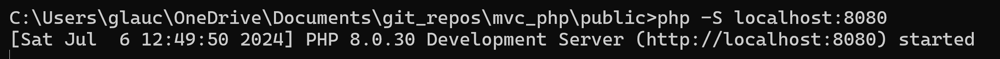
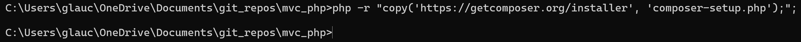
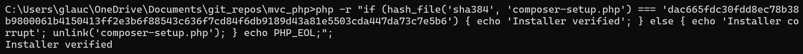
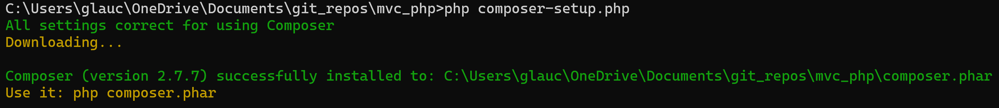
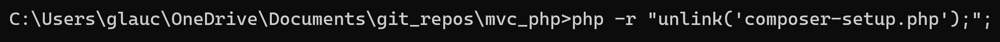
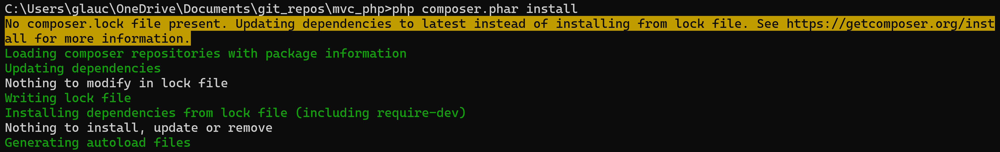
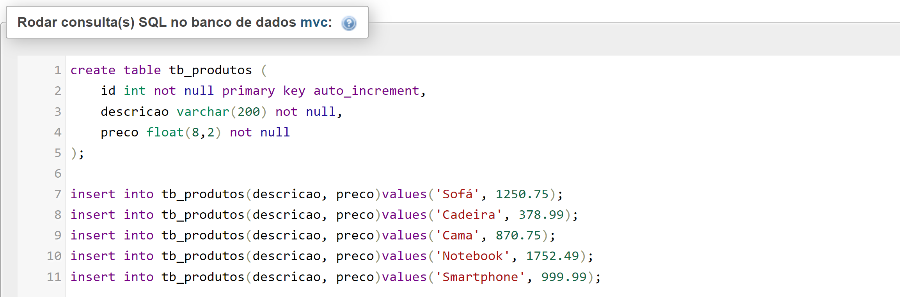

# MVC_php
Model View Controler com PHP

## Tools
- [bootstrap](https://getbootstrap.com/)  
- [jquery](https://releases.jquery.com/)  
- [composer](https://getcomposer.org/)  

## Iniciando Local Server PHP

## Composer
- Install  
  
- Verificando integridade  
  
- Executando script
  
- Removendo script após instalação  
  
- Create composer.json file  
- Run .phar file  

## MySQL
  
  